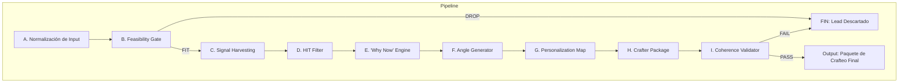
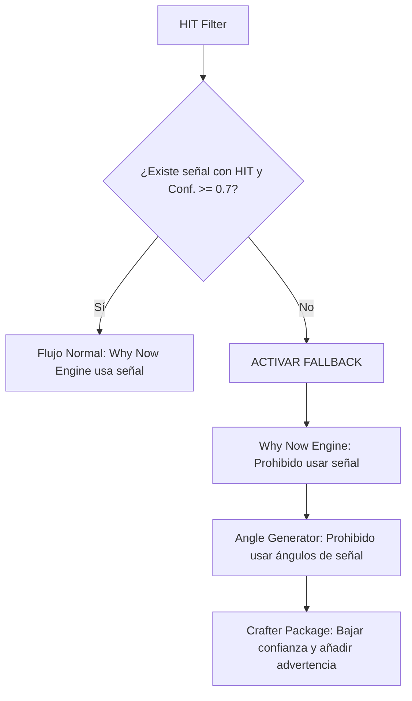

'''
# DOCUMENTACIÓN TÉCNICA: SISTEMA AOS PRE-CRAFTER v7 (DEFINITIVE)

**Versión:** 7.0
**Fecha:** 2024-12-16
**Autor:** Manus AI

---

## 1. Arquitectura del Sistema (Pipeline de Producción)

Esta arquitectura está diseñada para ser un pipeline de producción implacable y anti-humo. Su único objetivo es transformar datos brutos de un lead en un paquete de crafteo directamente utilizable, garantizando que cada email sea ultra-relevante y ultra-personalizado. El sistema opera bajo una regla fundamental: **si no se puede verificar, no existe**.



### A. Normalización de Input (Lead Intake)

-   **Lógica:** Estandariza y enriquece el input inicial para crear un perfil de lead unificado y consistente. Elimina ambigüedades desde el principio.
-   **Entrada:** Datos brutos del lead (CSV, API, etc.).
-   **Salida:** `lead_profile_normalized.json`

### B. Feasibility Gate (Stop-the-line)

-   **Lógica:** Un filtro implacable para detener el procesamiento de leads que no cumplen con los requisitos mínimos de calidad. El sistema no inventa ni asume; si un lead no es viable, se detiene.
-   **Entrada:** `lead_profile_normalized.json`
-   **Salida:** `feasibility_report.json` (con status `PASS` o `DROP`).

### C. Signal Harvesting (Perplexity)

-   **Lógica:** El módulo de inteligencia activa. Construye queries de alta precisión para Perplexity y extrae 5 tipos de señales verificables del mundo real. Cada señal es una pieza de evidencia.
-   **Entrada:** `lead_profile_normalized.json` (si el status es `PASS`).
-   **Salida:** `signal_bank.json`

### D. HIT Filter (Priorización Brutal)

-   **Lógica:** No todas las señales son iguales. Este filtro clasifica cada señal según su impacto y relevancia, permitiendo al sistema enfocarse solo en lo que realmente importa.
-   **Entrada:** `signal_bank.json`
-   **Salida:** `hit_filter_results.json`

### E. “Why Now” Engine

-   **Lógica:** Selecciona la señal ganadora (`HIT`) y la transforma en un argumento de urgencia claro y conciso. Este es el corazón del "Why Now".
-   **Entrada:** `hit_filter_results.json`
-   **Salida:** `why_now_block.json`

### F. Angle Generator

-   **Lógica:** Construye tres ángulos de venta distintos basados en la señal ganadora y el perfil del lead, siguiendo una jerarquía estricta para asegurar la máxima persuasión.
-   **Entrada:** `why_now_block.json`, `lead_profile_normalized.json`
-   **Salida:** `angles_block.json`

### G. Personalization Map (Hiperpersonalización Utilizable)

-   **Lógica:** Crea un mapa de puntos de personalización que el Crafter puede usar para que el email suene escrito por un humano que ha hecho su tarea, no por una máquina.
-   **Entrada:** `lead_profile_normalized.json`
-   **Salida:** `personalization_map.json`

### H. Crafter Package (Output Final)

-   **Lógica:** Ensambla todos los componentes de inteligencia en un paquete final y completo. Este es el único artefacto que el Crafter necesita para escribir el email sin pensar.
-   **Entrada:** Todos los outputs anteriores.
-   **Salida:** `crafter_package.json`

### I. Coherence Validator (Implacable)

-   **Lógica:** Un control de calidad final y no negociable. Valida que el paquete de crafteo cumpla con los estándares de relevancia, personalización y anti-humo antes de ser liberado.
-   **Entrada:** `crafter_package.json`
-   **Salida:** `qa_report.json`
'''
'''
## 2. Esquemas JSON (Contratos de Datos - Draft 2020-12)

Cada módulo del pipeline se comunica a través de contratos de datos estrictos definidos por los siguientes JSON Schemas. La validación es obligatoria.

### A. `lead_profile_normalized.json`

```json
{
  "$schema": "https://json-schema.org/draft/2020-12/schema",
  "$id": "https://aos.com/schemas/lead_profile_normalized.json",
  "title": "Lead Profile Normalized",
  "description": "Perfil de lead unificado después de la estandarización.",
  "type": "object",
  "properties": {
    "company": {
      "type": "object",
      "properties": {
        "name": { "type": "string", "minLength": 1 },
        "website": { "type": "string", "format": "uri" },
        "linkedin_url": { "type": "string", "format": "uri" },
        "industry": { "type": "string" },
        "description": { "type": "string", "maxLength": 1500 }
      },
      "required": ["name", "website"],
      "additionalProperties": false
    },
    "person": {
      "type": "object",
      "properties": {
        "first_name": { "type": "string" },
        "last_name": { "type": "string" },
        "linkedin_url": { "type": "string", "format": "uri" },
        "title": { "type": "string" }
      },
      "required": ["first_name", "linkedin_url", "title"],
      "additionalProperties": false
    },
    "offering": {
      "type": "object",
      "properties": {
        "base_contribution": { "type": "string" }
      },
      "required": ["base_contribution"],
      "additionalProperties": false
    },
    "campaign_settings": {
      "type": "object",
      "properties": {
        "tone": { "enum": ["Formal", "Directo", "Casual"] },
        "language": { "enum": ["es-ES", "en-US"] }
      },
      "required": ["tone", "language"],
      "additionalProperties": false
    }
  },
  "required": ["company", "person", "offering", "campaign_settings"],
  "additionalProperties": false,
  "examples": [
    {
      "company": {
        "name": "InnovateTech",
        "website": "https://innovatetech.com",
        "linkedin_url": "https://linkedin.com/company/innovatetech",
        "industry": "SaaS",
        "description": "Provides AI-driven solutions for supply chain optimization."
      },
      "person": {
        "first_name": "Jane",
        "last_name": "Doe",
        "linkedin_url": "https://linkedin.com/in/janedoe",
        "title": "VP of Operations"
      },
      "offering": {
        "base_contribution": "We help you get qualified meetings with your ideal customers."
      },
      "campaign_settings": {
        "tone": "Directo",
        "language": "en-US"
      }
    }
  ]
}
```

### B. `feasibility_report.json`

```json
{
  "$schema": "https://json-schema.org/draft/2020-12/schema",
  "$id": "https://aos.com/schemas/feasibility_report.json",
  "title": "Feasibility Report",
  "description": "Veredicto del Feasibility Gate.",
  "type": "object",
  "properties": {
    "status": { "enum": ["PASS", "DROP"] },
    "checks": {
      "type": "object",
      "properties": {
        "is_b2b_valid": { "$ref": "#/$defs/check" },
        "is_icp_plausible": { "$ref": "#/$defs/check" },
        "sourceability": { "$ref": "#/$defs/check" },
        "signal_detectability": { "$ref": "#/$defs/check" }
      },
      "required": ["is_b2b_valid", "is_icp_plausible", "sourceability", "signal_detectability"],
      "additionalProperties": false
    }
  },
  "required": ["status", "checks"],
  "additionalProperties": false,
  "$defs": {
    "check": {
      "type": "object",
      "properties": {
        "pass": { "type": "boolean" },
        "reason": { "type": "string" }
      },
      "required": ["pass", "reason"],
      "additionalProperties": false
    }
  }
}
```

### C. `signal_bank.json`

```json
{
  "$schema": "https://json-schema.org/draft/2020-12/schema",
  "$id": "https://aos.com/schemas/signal_bank.json",
  "title": "Signal Bank",
  "description": "Banco de todas las señales verificables extraídas.",
  "type": "object",
  "properties": {
    "signals": {
      "type": "array",
      "items": {
        "type": "object",
        "properties": {
          "type": { "enum": ["CompanyMove", "Hiring", "ProductTech", "MarketPressure", "Personal"] },
          "signal_text": { "type": "string", "minLength": 10 },
          "why_it_matters": { "type": "string", "minLength": 10 },
          "timestamp": { "type": "string", "format": "date" },
          "source_url": { "type": "string", "format": "uri" },
          "evidence_snippet": { "type": "string", "maxLength": 200 },
          "confidence": { "type": "number", "minimum": 0, "maximum": 1 }
        },
        "required": ["type", "signal_text", "why_it_matters", "timestamp", "source_url", "evidence_snippet", "confidence"],
        "additionalProperties": false
      }
    }
  },
  "required": ["signals"],
  "additionalProperties": false
}
```

### D. `hit_filter_results.json`

```json
{
  "$schema": "https://json-schema.org/draft/2020-12/schema",
  "$id": "https://aos.com/schemas/hit_filter_results.json",
  "title": "HIT Filter Results",
  "description": "Señales clasificadas por relevancia e impacto.",
  "type": "object",
  "properties": {
    "classified_signals": {
      "type": "array",
      "items": {
        "type": "object",
        "properties": {
          "classification": { "enum": ["HIT", "INCLUDE", "STORE", "UNCLEAR", "EXCLUDE"] },
          "reasoning": { "type": "string" },
          "signal": { "$ref": "https://aos.com/schemas/signal_bank.json#/properties/signals/items" }
        },
        "required": ["classification", "reasoning", "signal"],
        "additionalProperties": false
      }
    }
  },
  "required": ["classified_signals"],
  "additionalProperties": false
}
```

### E. `why_now_block.json`

```json
{
  "$schema": "https://json-schema.org/draft/2020-12/schema",
  "$id": "https://aos.com/schemas/why_now_block.json",
  "title": "Why Now Block",
  "description": "Argumento de urgencia construido desde la señal ganadora.",
  "type": "object",
  "properties": {
    "winning_signal": { "$ref": "https://aos.com/schemas/signal_bank.json#/properties/signals/items" },
    "why_now_one_liner": { "type": "string", "maxLength": 150 },
    "why_now_reasoning": { "type": "string", "maxLength": 500 },
    "risk_if_ignored": { "type": "string" },
    "business_value": { "type": "string" }
  },
  "required": ["winning_signal", "why_now_one_liner", "risk_if_ignored", "business_value"],
  "additionalProperties": false
}
```

### F. `angles_block.json`

```json
{
  "$schema": "https://json-schema.org/draft/2020-12/schema",
  "$id": "https://aos.com/schemas/angles_block.json",
  "title": "Angles Block",
  "description": "Los tres ángulos de venta generados.",
  "type": "object",
  "properties": {
    "best_angle": { "$ref": "#/$defs/angle" },
    "second_best_angle": { "$ref": "#/$defs/angle" },
    "identity_angle": { "$ref": "#/$defs/angle" }
  },
  "required": ["best_angle", "second_best_angle", "identity_angle"],
  "additionalProperties": false,
  "$defs": {
    "angle": {
      "type": "object",
      "properties": {
        "hook": { "type": "string" },
        "signal_used": { "type": "string" },
        "narrative": { "type": "string" },
        "mapped_contribution": { "type": "string" }
      },
      "required": ["hook", "signal_used", "narrative", "mapped_contribution"],
      "additionalProperties": false
    }
  }
}
```

### G. `personalization_map.json`

```json
{
  "$schema": "https://json-schema.org/draft/2020-12/schema",
  "$id": "https://aos.com/schemas/personalization_map.json",
  "title": "Personalization Map",
  "description": "Mapa de hiperpersonalización para sonar humano.",
  "type": "object",
  "properties": {
    "role_kpi_pressure": { "type": "string" },
    "day_to_day_context": { "type": "string" },
    "language_mirroring": { "type": "array", "items": { "type": "string" }, "minItems": 2, "maxItems": 5 },
    "objections_likely": { "type": "array", "items": { "type": "string" }, "minItems": 2, "maxItems": 2 },
    "social_proof_style": { "enum": ["Numbers", "CaseStudies", "Speed", "RiskReduction"] },
    "personal_hook_options": { "type": "array", "items": { "type": "string" }, "minItems": 3, "maxItems": 3 }
  },
  "required": ["role_kpi_pressure", "language_mirroring", "objections_likely", "social_proof_style", "personal_hook_options"],
  "additionalProperties": false
}
```

### H. `crafter_package.json`

```json
{
  "$schema": "https://json-schema.org/draft/2020-12/schema",
  "$id": "https://aos.com/schemas/crafter_package.json",
  "title": "Crafter Package",
  "description": "El paquete final y completo para el Crafter.",
  "type": "object",
  "properties": {
    "subject_lines": { "type": "array", "items": { "type": "string" }, "minItems": 3, "maxItems": 3 },
    "icebreaker": { "type": "string" },
    "bridge": { "type": "string" },
    "contribution": { "type": "string" },
    "details": {
      "type": "object",
      "properties": {
        "bullets": { "type": "array", "items": { "type": "string" }, "minItems": 3, "maxItems": 3 },
        "closing_statement": { "type": "string" }
      },
      "required": ["bullets", "closing_statement"],
      "additionalProperties": false
    },
    "cta": {
      "type": "object",
      "properties": {
        "soft_close": { "type": "string" },
        "risk_reversal": { "type": "string" }
      },
      "required": ["soft_close", "risk_reversal"],
      "additionalProperties": false
    },
    "proof_pack": { "type": "array", "items": { "$ref": "https://aos.com/schemas/signal_bank.json#/properties/signals/items" } },
    "compliance_flags": { "type": "array", "items": { "type": "string" } },
    "confidence_overall": { "type": "number", "minimum": 0, "maximum": 1 }
  },
  "required": ["subject_lines", "icebreaker", "bridge", "contribution", "details", "cta", "proof_pack", "compliance_flags", "confidence_overall"],
  "additionalProperties": false
}
```

### I. `qa_report.json`

```json
{
  "$schema": "https://json-schema.org/draft/2020-12/schema",
  "$id": "https://aos.com/schemas/qa_report.json",
  "title": "QA Report",
  "description": "Veredicto final del validador de coherencia.",
  "type": "object",
  "properties": {
    "status": { "enum": ["PASS", "FAIL"] },
    "checks": {
      "type": "object",
      "properties": {
        "relevance_score": { "type": "integer", "minimum": 0, "maximum": 100 },
        "personalization_score": { "type": "integer", "minimum": 0, "maximum": 100 },
        "is_why_now_verified": { "type": "boolean" },
        "is_free_of_hallucinations": { "type": "boolean" },
        "is_narrative_tight": { "type": "boolean" }
      },
      "required": ["relevance_score", "personalization_score", "is_why_now_verified", "is_free_of_hallucinations", "is_narrative_tight"],
      "additionalProperties": false
    },
    "required_fixes": {
      "type": "array",
      "items": {
        "type": "object",
        "properties": {
          "section": { "type": "string" },
          "issue": { "type": "string" },
          "recommendation": { "type": "string" }
        },
        "required": ["section", "issue", "recommendation"],
        "additionalProperties": false
      }
    }
  },
  "required": ["status", "checks", "required_fixes"],
  "additionalProperties": false
}
```
'''
'''
## 3. Prompts Listos para Producción

Estos prompts están diseñados para ser ejecutados en un entorno de producción. Son explícitos, anti-humo y están optimizados para los modelos especificados.

### 3.1. Prompts de Investigación para Perplexity (Signal Harvesting)

**Lógica:** Se utiliza una plantilla de query base que se especializa para cada tipo de señal. El objetivo es forzar a Perplexity a actuar como un analista de inteligencia, no como un motor de búsqueda genérico.

**Plantilla Base de Query para Perplexity:**

```
Find recent (last 180 days) verifiable signals for the company \"{{company.name}}\" ({{company.website}}). Focus on [TIPO DE SEÑAL]. For each signal, provide a summary, the source URL, and the date.

[VARIANTE PARA EMPRESAS PEQUEÑAS]
```

**Especializaciones por Tipo de Señal:**

1.  **Company Moves:**
    -   **Focus:** `new product launches, funding rounds, partnerships, mergers, acquisitions, or geographical expansion`.

2.  **Hiring Signals:**
    -   **Focus:** `key executive hires (C-level, VP), mass hiring sprees, or the opening of new engineering/sales hubs`. Search LinkedIn job postings and official company announcements.

3.  **Product/Tech Signals:**
    -   **Focus:** `mentions of their technology stack, migrations to new platforms (e.g., AWS, Salesforce), or new key integrations with other software`. Search developer blogs, technical articles, and press releases.

4.  **Market Pressure:**
    -   **Focus:** `actions from their main competitors ({{list_of_competitors}}), new regulations affecting their industry ({{company.industry}}), or significant macroeconomic trends`.

5.  **Personal Signals:**
    -   **Focus:** `recent promotions, job changes, published articles, interviews, or significant posts on LinkedIn for \"{{person.first_name}} {{person.last_name}}\" of \"{{company.name}}\"`.

**Variante para Empresas Pequeñas (Low-Press):**

Si la empresa tiene baja presencia en noticias, se añade la siguiente instrucción a la query:

```
Since this is a smaller company, expand the search to include local business journals, industry-specific forums, and detailed analysis of their LinkedIn activity and website changes.
```

### 3.2. Prompts de Generación para Gemini 3 Pro

Estos prompts son los motores de razonamiento del pipeline. Toman los datos estructurados y los transforman en inteligencia y contenido.

**A. `Why Now` Engine**

```
# ROLE: Chief Intelligence Analyst
# GOAL: Select the single most powerful signal (the winning HIT) and transform it into a compelling \"Why Now\" argument.
# INPUT: hit_filter_results.json
# OUTPUT: why_now_block.json

Analyze the provided classified signals. Select the signal with the 'HIT' classification that has the highest confidence score. If there are multiple HITs, choose the one with the most direct link to a business pain point.

Based on this winning signal, generate the 'why_now_block' by following these rules:
1.  **why_now_one_liner**: A single, hard-hitting sentence stating the reason for contact. No fluff.
2.  **why_now_reasoning**: 2-3 sentences providing the immediate context of the signal. Pure facts.
3.  **risk_if_ignored**: The tangible, negative business consequence of inaction.
4.  **business_value**: The tangible, positive business impact of taking action.

Return a single, valid JSON object according to the `why_now_block.json` schema.
```

**B. Angle Generator**

```
# ROLE: Master Strategist
# GOAL: Generate three distinct, high-impact sales angles based on the provided intelligence.
# INPUT: why_now_block.json, lead_profile_normalized.json, hit_filter_results.json
# OUTPUT: angles_block.json

Generate exactly three sales angles following this strict hierarchy and rules:

1.  **best_angle**: Must use the 'winning_signal' from the `why_now_block`. The narrative must connect this signal to a core business problem and how our contribution solves it.
2.  **second_best_angle**: Must use a different signal classified as 'INCLUDE' from `hit_filter_results.json`. It must present an alternative logical argument.
3.  **identity_angle**: Must NOT use any external signal. The hook must appeal directly to the person's role/mandate (e.g., \"As a VP of Engineering, technical debt is always top of mind\"). The narrative must focus on a classic pain point for that specific role.

For each angle, provide:
- **hook**: The killer opening phrase.
- **signal_used**: The exact signal_text or \"inferred_from_role\".
- **narrative**: The story connecting the signal/pain to the solution.
- **mapped_contribution**: The exact offering.base_contribution that solves this angle's problem.

If no signal has confidence >= 0.7, you are FORBIDDEN from creating `best_angle` and `second_best_angle` based on facts. In this case, both must be based on inferred role-based pain points, and the `signal_used` field must state \"inferred_pain_by_role\".

Return a single, valid JSON object according to the `angles_block.json` schema.
```

**C. Personalization Map**

```
# ROLE: Corporate Anthropologist
# GOAL: Create a usable map of personalization points to make the email sound hyper-human and deeply researched.
# INPUT: lead_profile_normalized.json
# OUTPUT: personalization_map.json

Analyze the normalized lead profile to infer the following personalization points:

1.  **role_kpi_pressure**: What is the single most important metric this person's performance is likely judged on?
2.  **day_to_day_context**: What is a realistic, non-generic task or challenge they are likely dealing with this quarter?
3.  **language_mirroring**: Extract 5 keywords or phrases from their LinkedIn summary or company description that reflect their professional jargon.
4.  **objections_likely**: Based on their company size and industry, what are the two most probable initial objections to our offer?
5.  **social_proof_style**: What type of proof would be most convincing to this person? (Numbers, CaseStudies, Speed, RiskReduction).
6.  **personal_hook_options**: Generate three distinct, one-sentence hooks that connect our offering to their specific world.

Return a single, valid JSON object according to the `personalization_map.json` schema.
```

**D. Crafter Package**

```
# ROLE: Head of Campaign Operations
# GOAL: Assemble the final, complete package for the Crafter, leaving zero room for interpretation or creative work.
# INPUT: why_now_block.json, angles_block.json, personalization_map.json, lead_profile_normalized.json
# OUTPUT: crafter_package.json

Select the `best_angle` from the `angles_block`. Synthesize all provided intelligence into the final `crafter_package.json`. Follow these instructions relentlessly:

- **subject_lines**: Generate 3 short, direct, and intriguing subject lines. One must be a question.
- **icebreaker**: Construct the 1-4 sentence opening block. It MUST contain the hook from the best angle and the core of the 'Why Now' signal.
- **bridge**: Write 1-2 sentences that logically connect the problem (implication) to the solution (contribution).
- **contribution**: Write the single \"magic bullet\" sentence, using the `mapped_contribution` from the best angle.
- **details**: Populate the 3 standard bullets (Lead Sourcing, Deep Personalization, E2E Management) and the closing statement.
- **cta**: Populate the standard soft close and risk reversal.
- **proof_pack**: Extract all evidence (URL, snippet, date) from the signals used.
- **compliance_flags**: Add any constraints from the initial input.
- **confidence_overall**: Calculate as the average confidence of the signals used.

Return a single, valid JSON object according to the `crafter_package.json` schema.
```

**E. Coherence Validator (QA)**

```
# ROLE: Implacable QA Automaton
# GOAL: Perform a final, ruthless validation of the crafter package. No mercy.
# INPUT: crafter_package.json
# OUTPUT: qa_report.json

Execute the following validation checks on the `crafter_package.json` and generate the `qa_report.json`:

1.  **Relevance Score**: Is there a `why_now` based on a verified signal with confidence >= 0.7? Does the `icebreaker` directly reference it? Score 0-100.
2.  **Personalization Score**: Does the package use at least one anchor from the company, one from the role, and one language mirror? Score 0-100.
3.  **is_why_now_verified**: True if the `proof_pack` is not empty and URLs are valid. False otherwise.
4.  **is_free_of_hallucinations**: True if all claims are backed by the `proof_pack`. False otherwise.
5.  **is_narrative_tight**: True if every sentence serves a purpose and there is no fluff. False otherwise.

If any check fails or scores below 70, set status to 'FAIL' and provide a specific, actionable fix in `required_fixes`. Otherwise, set status to 'PASS'.

Return a single, valid JSON object according to the `qa_report.json` schema.
```

---

## 4. Reglas “Anti-Hallucination” y Sistema de Fallback

El sistema está diseñado para ser honesto. La peor ofensa es inventar una relevancia que no existe. Estas reglas no son negociables y se aplican de forma automática.

### El Umbral de Confianza

La unidad fundamental de la verdad en este sistema es la `confidence` de una señal. El umbral mínimo para que una señal sea considerada un **hecho** es **0.7**. Cualquier señal por debajo de este umbral se trata como una hipótesis, no como una certeza.

### El Protocolo de Fallback Implacable

Este protocolo se activa automáticamente si el `HIT Filter` no encuentra ninguna señal con `classification: "HIT"` Y `confidence >= 0.7`.

1.  **Prohibición de "Why Now" Basado en Hechos**: El `Why Now Engine` tiene prohibido generar un `why_now_block` basado en una señal externa. El campo `winning_signal` se marcará como `null`.

2.  **Caída a Ángulos de Identidad y Dolor Inferido**: El `Angle Generator` tiene prohibido generar `best_angle` y `second_best_angle` basados en señales. Ambos ángulos deben basarse en dolores inferidos del rol (`inferred_pain_by_role`), similar al `identity_angle`.

3.  **Ajuste de Confianza General**: En el `crafter_package`, el campo `confidence_overall` se establecerá en un valor bajo (**0.3**) para reflejar la naturaleza especulativa del email.

4.  **Bandera de Cumplimiento**: Se añadirá una bandera obligatoria en `compliance_flags`: `\"ADVERTENCIA: Email basado en dolor inferido, no en una señal externa verificada. Usar con precaución.\"`

### Diagrama de Flujo del Fallback


'''

## 5. Ejemplo End-to-End (Datos Ficticios)

Esta sección demuestra el flujo completo del pipeline con un ejemplo concreto, desde el input inicial hasta el paquete de crafteo final.

### Input: Datos Brutos del Lead

- **Empresa:** InnovateTech Solutions
- **Web:** `https://innovatetech.com`
- **Contacto:** Jane Doe, VP of Operations
- **LinkedIn:** `https://linkedin.com/in/janedoe`
- **Descripción:** "InnovateTech Solutions ofrece soluciones de software de optimización de la cadena de suministro basadas en IA para empresas de logística."

### A. Output: `lead_profile_normalized.json`

```json
{
  "company": {
    "name": "InnovateTech Solutions",
    "website": "https://innovatetech.com",
    "linkedin_url": "https://linkedin.com/company/innovatetech-solutions",
    "industry": "Logistics & Supply Chain Tech",
    "description": "InnovateTech Solutions ofrece soluciones de software de optimización de la cadena de suministro basadas en IA para empresas de logística."
  },
  "person": {
    "first_name": "Jane",
    "last_name": "Doe",
    "linkedin_url": "https://linkedin.com/in/janedoe",
    "title": "VP of Operations"
  },
  "offering": {
    "base_contribution": "Te ayudamos a conseguir reuniones cualificadas con tus clientes ideales en el sector logístico."
  },
  "campaign_settings": {
    "tone": "Directo",
    "language": "en-US"
  }
}
```

### B. Output: `feasibility_report.json`

```json
{
  "status": "PASS",
  "checks": {
    "is_b2b_valid": { "pass": true, "reason": "La empresa es un proveedor de SaaS B2B." },
    "is_icp_plausible": { "pass": true, "reason": "La empresa encaja en el ICP de tecnología y logística." },
    "sourceability": { "pass": true, "reason": "Se ha encontrado un email verificado para el contacto." },
    "signal_detectability": { "pass": true, "reason": "La empresa y su sector tienen una presencia digital activa, alta probabilidad de encontrar señales." }
  }
}
```

### C. Output: `signal_bank.json`

```json
{
  "signals": [
    {
      "type": "MarketPressure",
      "signal_text": "El principal competidor, LogiNext, levanta una ronda de $50M para expandirse en Norteamérica.",
      "why_it_matters": "Aumenta la presión competitiva directa en el mercado principal de InnovateTech.",
      "timestamp": "2024-12-10",
      "source_url": "https://techcrunch.com/2024/12/10/loginext-raises-50m-series-b/",
      "evidence_snippet": "LogiNext has raised $50 million in a Series B round to fuel its North American expansion, targeting mid-market logistics companies.",
      "confidence": 0.95
    },
    {
      "type": "Hiring",
      "signal_text": "InnovateTech está contratando activamente para 15 puestos de 'Sales Development Representative'.",
      "why_it_matters": "Indica un fuerte impulso para la expansión de ventas y la necesidad de llenar el pipeline.",
      "timestamp": "2024-11-28",
      "source_url": "https://linkedin.com/company/innovatetech-solutions/jobs/",
      "evidence_snippet": "Now hiring: Sales Development Representative (15 roles). Join our fast-growing team!",
      "confidence": 0.8
    }
  ]
}
```

### D. Output: `hit_filter_results.json`

```json
{
  "classified_signals": [
    {
      "classification": "HIT",
      "reasoning": "Señal externa fuerte, amenaza directa, conecta perfectamente con nuestra contribución de generación de pipeline.",
      "signal": {
        "type": "MarketPressure",
        "signal_text": "El principal competidor, LogiNext, levanta una ronda de $50M para expandirse en Norteamérica.",
        "why_it_matters": "Aumenta la presión competitiva directa en el mercado principal de InnovateTech.",
        "timestamp": "2024-12-10",
        "source_url": "https://techcrunch.com/2024/12/10/loginext-raises-50m-series-b/",
        "evidence_snippet": "LogiNext has raised $50 million in a Series B round to fuel its North American expansion, targeting mid-market logistics companies.",
        "confidence": 0.95
      }
    },
    {
      "classification": "INCLUDE",
      "reasoning": "Buena señal interna que apoya la necesidad de pipeline, pero menos urgente que la amenaza externa.",
      "signal": {
        "type": "Hiring",
        "signal_text": "InnovateTech está contratando activamente para 15 puestos de 'Sales Development Representative'.",
        "why_it_matters": "Indica un fuerte impulso para la expansión de ventas y la necesidad de llenar el pipeline.",
        "timestamp": "2024-11-28",
        "source_url": "https://linkedin.com/company/innovatetech-solutions/jobs/",
        "evidence_snippet": "Now hiring: Sales Development Representative (15 roles). Join our fast-growing team!",
        "confidence": 0.8
      }
    }
  ]
}
```

### E. Output: `why_now_block.json`

```json
{
  "winning_signal": { "..." }, // Objeto completo de la señal HIT de LogiNext
  "why_now_one_liner": "He visto que vuestro competidor directo, LogiNext, acaba de levantar $50M para acelerar su expansión en vuestro mercado.",
  "why_now_reasoning": "La ronda de financiación de LogiNext, anunciada la semana pasada en TechCrunch, está destinada específicamente a la expansión en Norteamérica. Esto significa que una nueva ola de competencia agresiva está a punto de llegar.",
  "risk_if_ignored": "Si no actúas, corres el riesgo de que LogiNext capture a tus clientes potenciales antes de que tengas la oportunidad de hablar con ellos, erosionando tu cuota de mercado.",
  "business_value": "Actuar ahora te permitiría construir una defensa proactiva, asegurando reuniones con tus 100 clientes ideales antes de que la campaña de LogiNext gane tracción."
}
```

### F. Output: `angles_block.json`

```json
{
  "best_angle": {
    "hook": "La ronda de $50M de LogiNext es una amenaza directa a vuestro pipeline.",
    "signal_used": "El principal competidor, LogiNext, levanta una ronda de $50M para expandirse en Norteamérica.",
    "narrative": "Con $50M, LogiNext va a inundar el mercado con SDRs. La única forma de defenderse es llegar primero a los clientes clave. Una estrategia de esperar y ver es una receta para perder cuota de mercado.",
    "mapped_contribution": "Te ayudamos a conseguir reuniones cualificadas con tus clientes ideales en el sector logístico."
  },
  "second_best_angle": {
    "hook": "¿Cómo vais a llenar el pipeline de vuestros 15 nuevos SDRs?",
    "signal_used": "InnovateTech está contratando activamente para 15 puestos de 'Sales Development Representative'.",
    "narrative": "Contratar 15 SDRs es una gran inversión. Pero un SDR sin un flujo constante de reuniones cualificadas es un coste, no una inversión. Necesitan un sistema que les alimente de forma predecible.",
    "mapped_contribution": "Te ayudamos a conseguir reuniones cualificadas con tus clientes ideales en el sector logístico."
  },
  "identity_angle": {
    "hook": "Como VP de Operaciones, la eficiencia del pipeline de ventas es tu responsabilidad.",
    "signal_used": "inferred_from_role",
    "narrative": "Un pipeline de ventas impredecible es el mayor enemigo de la eficiencia operativa. Afecta a la previsión de ingresos, a la moral del equipo y a la capacidad de escalar. Un sistema predecible es clave para la tranquilidad.",
    "mapped_contribution": "Te ayudamos a conseguir reuniones cualificadas con tus clientes ideales en el sector logístico."
  }
}
```

### G. Output: `personalization_map.json`

```json
{
  "role_kpi_pressure": "Mejorar la eficiencia operativa y reducir el Coste de Adquisición de Cliente (CAC).",
  "day_to_day_context": "Probablemente está supervisando la integración de los nuevos SDRs y preocupada por su rampa de productividad.",
  "language_mirroring": ["optimización", "cadena de suministro", "basado en IA", "eficiencia", "escalar"],
  "objections_likely": ["Ya tenemos un equipo interno de SDRs", "No tenemos presupuesto para agencias externas"],
  "social_proof_style": "Numbers",
  "personal_hook_options": [
    "¿Está tu pipeline preparado para la ofensiva de LogiNext?",
    "La eficiencia de tus nuevos SDRs depende de la calidad de sus reuniones.",
    "Una pregunta sobre la optimización de vuestro pipeline de ventas."
  ]
}
```

### H. Output: `crafter_package.json`

```json
{
  "subject_lines": [
    "Pregunta sobre LogiNext",
    "Vuestro pipeline vs. los $50M de LogiNext",
    "¿Preparados para la competencia?"
  ],
  "icebreaker": "Hola Jane, he visto la noticia en TechCrunch sobre la ronda de $50M de LogiNext para expandirse en Norteamérica. Esto parece una amenaza directa a vuestro mercado, y me preguntaba cómo estáis pensando en defender vuestro pipeline.",
  "bridge": "Anticiparse a su ofensiva de ventas es clave para no perder cuota de mercado. Llegar primero a vuestros clientes ideales es la única defensa real.",
  "contribution": "Podemos ayudarte a conseguir reuniones cualificadas con tus 100 clientes logísticos ideales en los próximos 60 días.",
  "details": {
    "bullets": [
      "Identificamos y contactamos a los decision-makers correctos en tus cuentas objetivo.",
      "Creamos emails ultra-personalizados basados en señales de mercado reales para cada uno.",
      "Gestionamos todo el proceso, tú solo asistes a las reuniones."
    ],
    "closing_statement": "Es un servicio de generación de pipeline, hecho a medida y de principio a fin."
  },
  "cta": {
    "soft_close": "Si la idea de llenar los calendarios de tus nuevos SDRs con reuniones cualificadas te parece interesante...",
    "risk_reversal": "...podemos mostrarte cómo en una demo de 10 minutos, donde te regalamos una lista de 50 leads cualificados para ti, sin ningún compromiso."
  },
  "proof_pack": [
    {
      "type": "MarketPressure",
      "signal_text": "El principal competidor, LogiNext, levanta una ronda de $50M para expandirse en Norteamérica.",
      "timestamp": "2024-12-10",
      "source_url": "https://techcrunch.com/2024/12/10/loginext-raises-50m-series-b/",
      "evidence_snippet": "LogiNext has raised $50 million in a Series B round to fuel its North American expansion, targeting mid-market logistics companies.",
      "confidence": 0.95
    }
  ],
  "compliance_flags": [],
  "confidence_overall": 0.95
}
```

### I. Output: `qa_report.json`

```json
{
  "status": "PASS",
  "checks": {
    "relevance_score": 100,
    "personalization_score": 80,
    "is_why_now_verified": true,
    "is_free_of_hallucinations": true,
    "is_narrative_tight": true
  },
  "required_fixes": []
}
```

## 6. Definiciones Operativas y Scoring

Para eliminar la subjetividad, la "calidad" se mide. La relevancia y la personalización se cuantifican con un sistema de puntuación que el `Coherence Validator` utiliza para emitir su veredicto `PASS/FAIL`.

### Fórmula y Scoring de Relevancia

> **Definición Operativa de Relevancia**: Un email es relevante si y solo si está anclado a una razón verificable para escribir **hoy**, esa razón implica una consecuencia tangible para el negocio del prospecto, y nuestra contribución resuelve directamente esa consecuencia.

**Fórmula de `relevance_score`:**

`relevance_score = (Puntos_Ancla * 1) + (Puntos_Implicacion * 1) + (Puntos_Conexion * 1)`

| Criterio | Ponderación | Puntos | Condición para Puntos |
| :--- | :--- | :--- | :--- |
| **Ancla "Why Now" Verificable** | 1 | 50 | El `crafter_package` contiene un `proof_pack` con al menos una señal con `confidence >= 0.7`. |
| **Implicación de Dolor/Oportunidad** | 1 | 30 | El `icebreaker` y el `bridge` articulan claramente un riesgo si se ignora la señal o un valor si se actúa. |
| **Conexión Directa con Contribución** | 1 | 20 | La `contribution` en el `crafter_package` es la solución lógica y directa al problema planteado por la implicación. |

**Umbral Mínimo para PASS: 70/100**. Un email sin un "Why Now" verificable (puntuación de 50 en el primer criterio) nunca puede ser aprobado.

### Fórmula y Scoring de Personalización

> **Definición Operativa de Personalización**: Un email es personalizado si y solo si demuestra (no declara) un entendimiento del contexto específico de la **empresa** y del **rol** del individuo, utiliza su **lenguaje**, y anticipa sus **objeciones**.

**Fórmula de `personalization_score`:**

`personalization_score = (Puntos_Ancla_Empresa * 1) + (Puntos_Ancla_Rol * 1) + (Puntos_Espejo * 1) + (Puntos_Anticipacion * 1)`

| Criterio | Ponderación | Puntos | Condición para Puntos |
| :--- | :--- | :--- | :--- |
| **Ancla de Empresa** | 1 | 30 | El email menciona un contexto específico de la empresa (ej. un lanzamiento, un competidor, una contratación). |
| **Ancla de Rol** | 1 | 30 | El email hace referencia a una presión o KPI específico del rol del individuo (del `personalization_map`). |
| **Espejo de Lenguaje** | 1 | 20 | El email utiliza al menos una de las palabras/expresiones del `language_mirroring` del `personalization_map`. |
| **Anticipación de Objeciones** | 1 | 20 | El `cta` o los `details` se adelantan a una de las `objections_likely` (ej. el `risk_reversal` combate la objeción de "no tengo tiempo/presupuesto"). |

**Umbral Mínimo para PASS: 70/100**.

---

## 7. Bloque Final: "Esto es lo que recibe el Crafter SIEMPRE"

Este es el contrato de salida del sistema. Independientemente de la complejidad del lead, de la cantidad de señales encontradas o del nivel de confianza, el Crafter siempre recibirá un paquete con esta estructura exacta. Es una lista cerrada y no negociable.

### El Paquete de Crafteo (Lista Cerrada)

| Campo | Descripción | Obligatorio |
| :--- | :--- | :---: |
| `subject_lines` | Array de 3 asuntos de email. | Sí |
| `icebreaker` | String de 1-4 frases (Hook + Anchor + Implication). | Sí |
| `bridge` | String de 1-2 frases (Conexión problema-solución). | Sí |
| `contribution` | String de 1 frase (La "magic bullet"). | Sí |
| `details.bullets` | Array de 3 strings (Lead Sourcing, Deep Personalization, E2E Management). | Sí |
| `details.closing_statement` | String de 1 frase ("Done-for-you"). | Sí |
| `cta.soft_close` | String de 1 frase (Invitación suave). | Sí |
| `cta.risk_reversal` | String de 1 frase (Eliminación de riesgo). | Sí |
| `proof_pack` | Array de objetos con `source_url`, `evidence_snippet`, `timestamp`. | Sí (puede estar vacío si no hay señales) |
| `compliance_flags` | Array de strings con restricciones. | Sí (puede estar vacío) |
| `confidence_overall` | Float de 0.0 a 1.0. | Sí |

### El Flujo de Trabajo del Crafter

El Crafter no piensa. El Crafter ejecuta. Su flujo de trabajo es:

1.  **Recibir** el `crafter_package.json`.
2.  **Revisar** el `confidence_overall`. Si es bajo (< 0.5), proceder con precaución.
3.  **Verificar** las URLs en `proof_pack`. Si alguna está rota, reportar.
4.  **Leer** los `compliance_flags`. No violarlos bajo ninguna circunstancia.
5.  **Ensamblar** el email copiando y pegando los bloques en orden: Asunto → Icebreaker → Bridge → Contribution → Details → CTA.
6.  **Pulir** el lenguaje para que suene natural, sin cambiar el contenido ni la estructura.
7.  **Enviar**.
